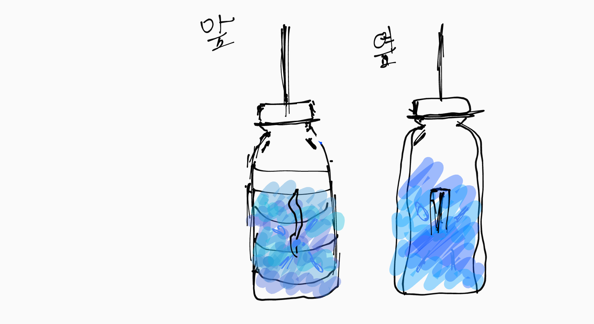

# 🌱 에코아트 프로젝트: 물고기에 변화

## 📖 프로젝트 개요
- **제작자**: 이인찬
- **제작일**: 7/16
- **소개**
> 저는 이 작품으로 현재 바다는 물고기보다 쓰레기가 더 많다는걸 알리고 물고기가 미세플라스틱을 먹어 우리의 안전을 해치고있다는걸 알리기 위해 만들었습니다.
페트병은 물고기를 표현했고 안에 넣은 비닐봉지는 미세플라스틱을 표현해서 우리는 미세플라스틱을 먹은 물고기를 섭취하면서 플라스틱을 먹은거랑 다를게없다는걸 알리려고 한다.

## 📦 사용 재료
- 아두이노, 온도센서, LED, 브레드보드
- 페트병, 비닐봉지

## 🔧 제작 과정

### 1단계: 아이디어 스케치

- 페트병을 물고기삼아 네임펜으로 물고기처럼 꾸미고 안에 비닐봉지와 LED를 넣어 미세플라스틱을 먹은 물고기라는걸 알리게하는거야 동시에 무드등같은 역할을 할수있게 만들었다.

### 2단계: 완성품

## 💭 제작 후기
### 잘된 점
- LED 불빛이 잘 켜졌음
- 예상했던대로 작품이 나왔음

### 아쉬운 점
- 아이디어 구상과정에서 내가 할수있는 선까지 퀄리티를 낮추느라 내가 하고싶었던 외형하고는 많이 퀄리티가 낮아짐
- LED에 의미를 부여하지 못함

### 개선할 점
- 디자인 관련해서 좀 더 개선하고 싶음
  

### 내가 이미 알고 있었던 것
- 에코 아트에 대해 알고있었음

### 새롭게 배운게 된 것
- 아두이노라는 곳에서 처음 코딩을 짜고 회로판을 만들었음

### 더 알고 싶은 것
- 아두이노로 더 많은 코딩을 배우고 싶음

## 🌍 환경적 의미
- 이 작품을 보고 사람들이 바다에 쓰레기를 버리지말자를 깨달아 더 이상 쓰레기를 버리지않아 바다생물들이 쓰레기때문에 위협되지않게 할수있는거와 동시에 우리의 안전에도 영향을 줄수있다.
- 페트병은 바다에 떠다녀 바다를 오염시키고 잘못하면 고래상어 등의 대형생물이 먹을수있다. 그리고 비닐봉지는 
- 나는 앞으로 플라스틱, 비닐봉지같은 일회용성 쓰레기를 최대한 배출하지 않고 바닷가 근처에 쓰레기가 보이면 가져가 처리하겠습니다.

## 📚 참고 자료
- [환경 관련 웹사이트](https://www.keco.or.kr/web/index.do;jsessionid=87BA327313B90D14F9805CE2997FB45B.hfkeco)
- [참고한 에코아트 작품](https://freshmindmag.com/2024/02/02/eco-art-artists-advocating-for-the-environment-through-creativity/?utm_source=chatgpt.com
)

## 🏷️ 태그
#에코아트 #재활용 #환경보호 #DIY #창의활동

---

> 이 프로젝트는 환경 보호와 창의적 사고를 위한 교육 목적으로 제작되었습니다.
